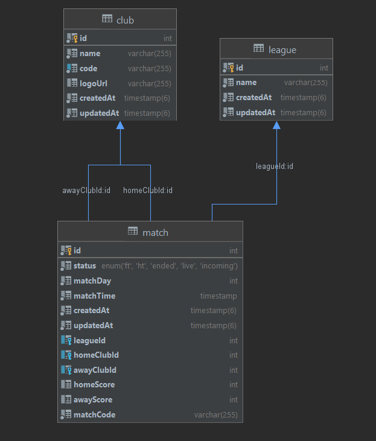

## Football Fixture

This is a small application for providing APIs for Football Fixture. 

To understand the project structure, libraries using in this project and how to run the code, please go to this [page](structure-explanation.md).

## Database design
I used MySQL database for this project.
Here is the database diagram.

## API Documentation
After run the project, access to  [http://localhost:3001/swagger](http://localhost:3001/swagger) to view the Swagger API documentation and [http://localhost:3001/api-docs](http://localhost:3001/api-docs) to get the json api-docs. 
